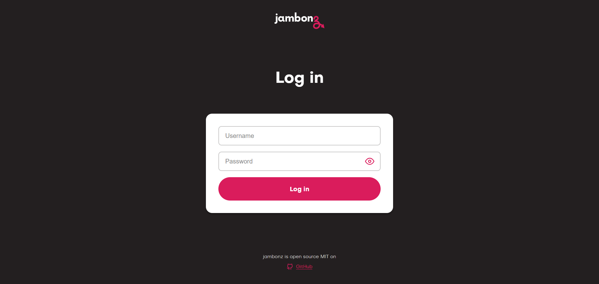
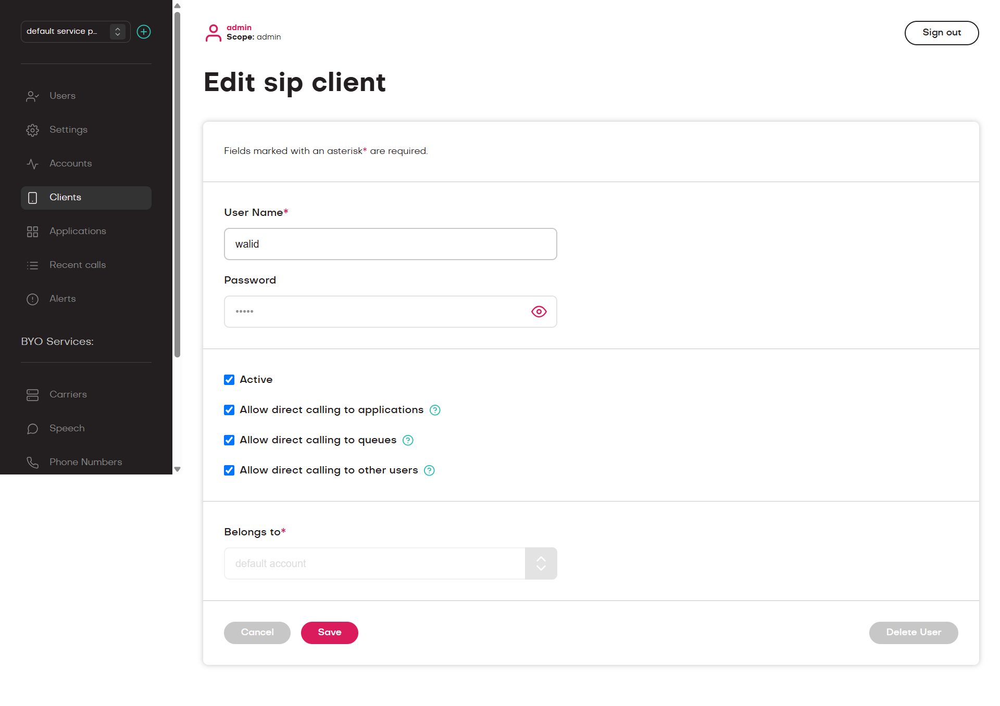
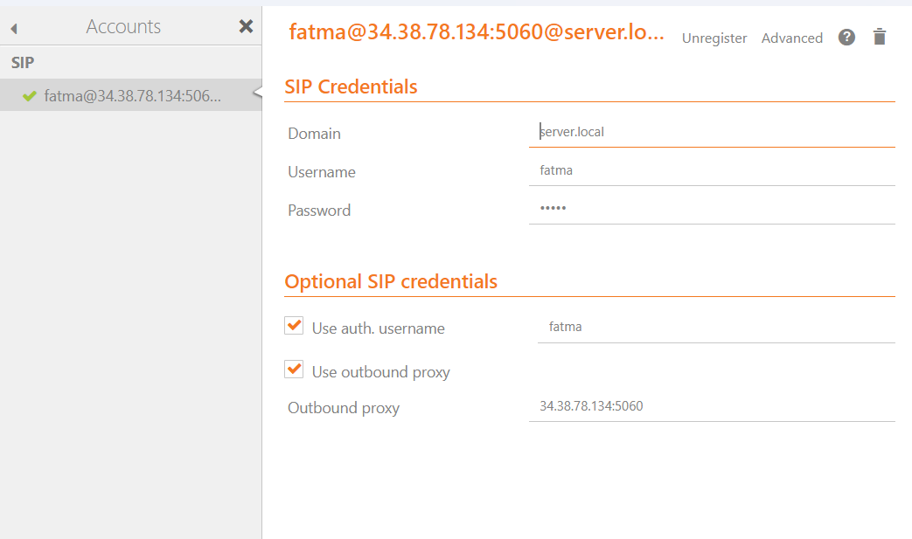

# Jambonz on Google Kubernetes Engine 


This guide walks through deploying Jambonz (an open-source VoIP platform) on a Google Kubernetes Engine cluster. 
The objective is to create a cluster on GCP from scratch and to make actual phone calls between two SIP clients (Soft Phones).

---


## What We're Building

In this guide, we'll accomplish two main tasks:
- **Task 1:** Set up a Kubernetes cluster on Google Cloud Platform
- **Task 2:** Deploy Jambonz with its multiple microservices

But before we jump into the technical steps, let's understand what we're actually working with.

### Understanding the Key Technologies

#### What is Kubernetes?

Think of Kubernetes as a smart system that automatically manages your applications. Instead of manually starting, stopping, and monitoring each piece of software, Kubernetes does it for you. It's like having an orchestra conductor that makes sure all your applications (the musicians) are playing together harmoniously.

Here are the basic building blocks:

| Concept | What it means | Project real example |
|---------|---------------|--------------|
| **Container** | Your application packaged with everything it needs to run | The Jambonz API with all its dependencies |
| **Pod** | The smallest unit Kubernetes manages (contains one or more containers) | A single API server instance |
| **Node** | A physical or virtual machine where your containers run | A Google Cloud VM |
| **Cluster** | A group of nodes working together | Your entire infrastructure |
| **Deployment** | Instructions telling Kubernetes what to run | "Keep 3 API servers running at all times" |
| **Service** | A way to access your applications over the network | The load balancer that routes SIP calls |

#### What is Google Kubernetes Engine (GKE)?

Setting up Kubernetes from scratch is complex and time-consuming. That's where cloud providers come in. GKE is Google's managed Kubernetes service, which means Google handles all the complicated infrastructure work for you provisioning servers, monitoring health, managing updates, and providing logging.

#### Why Do We Need Helm?

**Helm** is like a package manager for Kubernetes, similar to how `apt` works on Ubuntu or `npm` for Node.js projects.

Without Helm, deploying applications like Jambonz would require:
- Writing multiple of YAML configuration files
- Manually managing dependencies between services
- Keeping track of different versions across multiple files

Helm simplifies this into a single command that uses pre-built, tested templates.

**Quick Helm terminology:**

| Term | What it is | Example |
|------|-----------|---------|
| **Chart** | A package containing all the Kubernetes configs needed | The jambonz chart |
| **Release** | A running instance of a chart | Your deployed "jambonz" application |
| **Repository** | A collection of available charts | jambonz.github.io/helm-charts |
| **Values** | Your custom configuration settings | values.yaml file |

#### What is Jambonz?

**Jambonz** is an open-source CPaaS (Communications Platform as a Service) that lets you build your own VoIP communication system with features like:

- **Voice calling** over SIP
- **SMS messaging**
- **Speech recognition** and text-to-speech
- **Call routing and IVR** (Interactive Voice Response)
- **WebRTC** for browser-based calling

By the end of this guide, you'll have a fully functional VoIP platform running on Kubernetes that can handle real phone calls between users.


---

## Prerequisites

You'll need:
- Google Cloud account 
- These tools installed: `gcloud`, `kubectl`, `helm`

Quick verification:
```bash
gcloud version
kubectl version --client
helm version
```

---

## Part 1: Setting Up the Kubernetes Cluster

### Step 1: Configure GCP

Open your terminal and login:

```bash
gcloud auth login
gcloud config set project YOUR_PROJECT_ID
```


Enable necessary APIs:

```bash
gcloud services enable container.googleapis.com
gcloud services enable compute.googleapis.com
```

### Step 2: Create the Cluster

Now we are going to create a clu

Create a 3 node cluster in europe-west1-b (or your preferred zone):

```bash
gcloud container clusters create jambonz-cluster \
  --zone europe-west1-b \
  --num-nodes 3 \
  --machine-type e2-medium \
  --disk-size 50 \
  --enable-ip-alias
```

**Parameter Breakdown:**

| Parameter | Value | Why? |
|-----------|-------|------|
| `--zone` | `europe-west1-b` | Closest Geographic location to Paris |
| `--num-nodes` | `3` | High availability (1 node = single point of failure) |
| `--machine-type` | `e2-medium` | 2 vCPU, 4GB RAM (balanced for our application) |
| `--enable-ip-alias` |   | Required for VPC-native networking |
| `--disk-size` | `50` | Storage per node in GB |


This takes about 5 minutes. Each node has 2 vCPU and 4GB RAM.

Connect to the cluster:

```bash
gcloud container clusters get-credentials jambonz-cluster --zone europe-west1-b
```

Verify it's working:

```bash
kubectl get nodes
```

You should see 3 nodes in "Ready" status.

---

## Part 2: Deploying Jambonz

### Step 3: Install Jambonz with Helm

Add the Jambonz Helm repository:

```bash
helm repo add jambonz https://jambonz.github.io/helm-charts
helm repo update
```

Create a namespace:

```bash
kubectl create namespace jambonz
```

Create a `values.yaml` file for configuration:

```bash
cat > values.yaml <<EOF
cloud: gcp
monitoring:
  enabled: false
api:
  hostname: api.jambonz.local
webapp:
  hostname: webapp.jambonz.local
sbcSip:
  loglevel: info
  sofiaLoglevel: "3"
global:
  recordings:
    enabled: false
EOF
```

Install Jambonz:

```bash
helm install jambonz jambonz/jambonz -n jambonz -f values.yaml
```

Watch the deployment (this takes 5-10 minutes):

```bash
kubectl get pods -n jambonz -w
```

Press Ctrl+C when all pods show "Running" status.

### Step 4: Configure Networking

Label all nodes for SIP/RTP traffic:

```bash
kubectl get nodes -o name | xargs -I {} kubectl label {} voip-environment=sip --overwrite
```

Fix the RTP daemonset (it was looking for wrong labels):

```bash
kubectl patch daemonset jambonz-sbc-rtp -n jambonz --type=json \
  -p='[{"op": "replace", "path": "/spec/template/spec/nodeSelector", "value": {"voip-environment": "sip"}}]'
```

Expose services with LoadBalancers:

```bash
# Webapp
kubectl patch svc webapp -n jambonz -p '{"spec":{"type":"LoadBalancer"}}'

# API Server
kubectl patch svc api-server -n jambonz -p '{"spec":{"type":"LoadBalancer"}}'

# SIP Server
cat <<EOF | kubectl apply -f -
apiVersion: v1
kind: Service
metadata:
  name: sbc-sip-lb
  namespace: jambonz
spec:
  type: LoadBalancer
  ports:
  - port: 5060
    protocol: UDP
    targetPort: 5060
  selector:
    app: jambonz-sbc-sip
EOF
```

Wait for external IPs to be assigned (about 2 minutes):

```bash
kubectl get svc -n jambonz
```

Note down the external IPs for webapp, api-server, and sbc-sip-lb.

### Step 5: Configure Firewall Rules

GCP blocks all traffic by default. Open the necessary ports:

```bash
# SIP signaling
gcloud compute firewall-rules create jambonz-sip \
  --allow udp:5060,tcp:5060 \
  --source-ranges 0.0.0.0/0

# RTP media
gcloud compute firewall-rules create jambonz-rtp \
  --allow udp:40000-60000 \
  --source-ranges 0.0.0.0/0

# Web interface
gcloud compute firewall-rules create jambonz-webapp \
  --allow tcp:3001 \
  --source-ranges 0.0.0.0/0
```

### Step 6: Connect Webapp to API

The webapp needs to know where the API is:

```bash
API_IP=$(kubectl get svc api-server -n jambonz -o jsonpath='{.status.loadBalancer.ingress[0].ip}')
kubectl set env deployment/webapp -n jambonz API_BASE_URL=http://${API_IP}:3000/v1
kubectl rollout restart deployment/webapp -n jambonz
```

---

## Testing the Deployment

### Access the Web Interface

Get the webapp URL:

```bash
WEBAPP_IP=$(kubectl get svc webapp -n jambonz -o jsonpath='{.status.loadBalancer.ingress[0].ip}')
echo "Open: http://${WEBAPP_IP}:3001"
```

Login with:
- Username: `admin`
- Password: `admin`

---

## Configure for SIP Calling

### Step 1: Set the SIP Realm

```bash
kubectl exec -i mysql-0 -n jambonz -- mysql -ujambones -pjambones jambones <<'EOF'
UPDATE accounts SET sip_realm = 'server.local';
EOF
```

Verify it's set:

```bash
kubectl exec -it mysql-0 -n jambonz -- mysql -ujambones -pjambones jambones -e \
  "SELECT name, sip_realm FROM accounts;"
```

### Step 2: Create Dial Application

```bash
kubectl exec -i mysql-0 -n jambonz -- mysql -ujambones -pjambones jambones <<'EOF'
INSERT INTO applications (application_sid, name, account_sid, app_json)
SELECT
  UUID(),
  'dial-user',
  account_sid,
  '[{"verb":"dial","target":[{"type":"user","name":"${sip_req_user}"}]}]'
FROM accounts LIMIT 1;

UPDATE accounts 
SET device_calling_application_sid = (
  SELECT application_sid FROM applications WHERE name='dial-user' LIMIT 1
);
EOF
```

Verify the application is linked:

```bash
kubectl exec -it mysql-0 -n jambonz -- mysql -ujambones -pjambones jambones -e \
  "SELECT name, sip_realm, device_calling_application_sid FROM accounts;"
```

**Expected:** `device_calling_application_sid` should NOT be NULL.

### Step 3: Create Test Users via Web Interface

Users must be created through the Jambonz web interface.

1. Open the webapp:
```bash
WEBAPP_IP=$(kubectl get svc webapp -n jambonz -o jsonpath='{.status.loadBalancer.ingress[0].ip}')
echo "Open: http://${WEBAPP_IP}:3001"
```



2. Login with:
   - Username: `admin`
   - Password: `admin`
   
3. Navigate to **Accounts** and add your own **SIP Realm**


4. Navigate to **Clients** section in the menu

5. Click **Add Client** and create two users:
   - **User 1:** Username: `Walid`, Password: `password123`
   - **User 2:** Username: `Fatma`, Password: `password456`



Verify users were created:

```bash
kubectl exec -it mysql-0 -n jambonz -- mysql -ujambones -pjambones jambones -e \
  "SELECT username, is_active FROM clients;"
```

You should see both Fatma and Walid listed.

---

## Configure SIP Clients

### Get SIP Server IP

```bash
SIP_IP=$(kubectl get svc sbc-sip-lb -n jambonz -o jsonpath='{.status.loadBalancer.ingress[0].ip}')
echo "SIP Server IP: ${SIP_IP}"
```

### Configure Zoiper

**Critical:** Before adding accounts, disable STUN in Zoiper to avoid "error 57":

1. Open **Zoiper** → **Settings** → **Network**
2. Set **STUN**: **Disabled**
3. Set **ICE**: **Disabled**
4. Click **Save**

Now add accounts:

**For Fatma:**
```
Username: Fatma
Password: password123
Domain: server.local
Host: <SIP_IP>
Port: 5060
Transport: UDP
```



**For Walid:**
```
Username: Walid
Password: password456
Domain: server.local
Host: <SIP_IP>
Port: 5060
Transport: UDP
```

### Verify Registration

Watch SIP logs (specify the drachtio container):

```bash
kubectl logs -l app=jambonz-sbc-sip -n jambonz -c drachtio -f
```

You should see REGISTER requests and 200 OK responses when clients register successfully.

### Make a Test Call

1. Wait for both clients to show "Registered"
2. From Walid's client, dial: `Fatma`
3. Fatma's phone should ring
4. Answer and verify audio works

---

